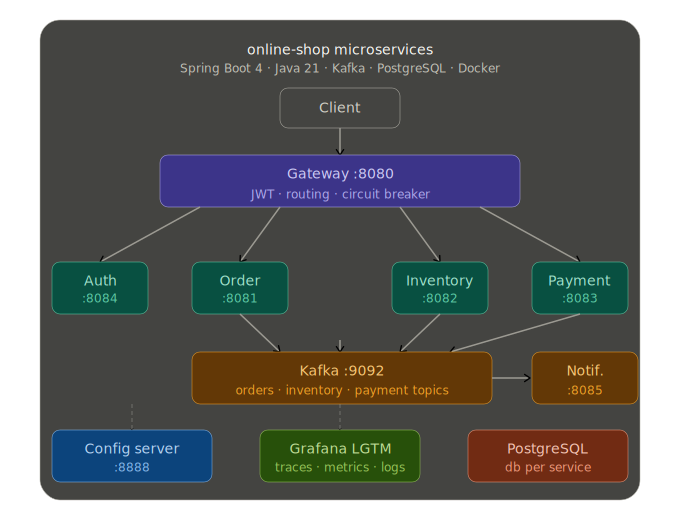
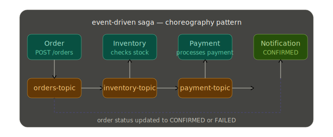

# Online Shop Microservices

A production-ready microservices-based online shop built with Spring Boot 4, demonstrating enterprise-grade patterns including event-driven saga, JWT authentication, distributed tracing, centralized configuration, API gateway, and Docker deployment.




## Documentation

- [Architecture](docs/ARCHITECTURE.md)
- [Roadmap](docs/ROADMAP.md)

## Architecture

```
Client → Spring Cloud Gateway (8080)
              ├── /auth/**         → Auth Service (8084)
              ├── /orders/**       → Order Service (8081)
              ├── /products/**     → Inventory Service (8082)
              └── /transactions/** → Payment Service (8083)

Config Server (8888) ← all services fetch config at startup
Grafana LGTM (3000)  ← traces, metrics, logs via OpenTelemetry
```

### Saga Flow (Event-Driven)
```
POST /orders → order-service → [orders-topic] → inventory-service → [inventory-topic] → payment-service → [payment-topic] → order-service
```

### Authentication Flow
```
POST /auth/register → auth-service → returns JWT
POST /auth/login    → auth-service → returns JWT
GET  /orders        → gateway validates JWT → order-service
```

## Tech Stack

- **Java 21**
- **Spring Boot 4.0.2**
- **Spring Cloud Gateway** — API gateway, JWT validation, single entry point
- **Spring Cloud Config** — Centralized configuration server for all services
- **Resilience4j** — Circuit Breaker on gateway with fallback responses
- **Spring Security** — JWT authentication via auth-service
- **Apache Kafka 4.2.0** — Event-driven communication (KRaft mode, no Zookeeper)
- **PostgreSQL 17** — Database per service pattern
- **Flyway** — Database migrations
- **OpenTelemetry** — Distributed tracing and metrics via `spring-boot-starter-opentelemetry`
- **Grafana LGTM** — Observability stack (Loki, Grafana, Tempo, Mimir)
- **Springdoc OpenAPI 3** — API documentation
- **Docker** — Multi-arch images (linux/amd64, linux/arm64)
- **Lombok** — Boilerplate reduction

## Services

| Service | Port | Database | Description |
|---------|------|----------|-------------|
| gateway-service | 8080 | - | API Gateway, JWT validation, Circuit Breaker |
| auth-service | 8084 | authdb | User registration, login, JWT generation |
| order-service | 8081 | orderdb | Manages orders, publishes to orders-topic |
| inventory-service | 8082 | inventorydb | Manages product stock, consumes orders-topic |
| payment-service | 8083 | paymentdb | Processes payments, consumes inventory-topic |
| notification-service | 8085 | - | Consumes payment-topic, logs order confirmations |
| config-server | 8888 | - | Centralized Spring Cloud Config Server |

## Observability

Every request is automatically traced end-to-end across all services using OpenTelemetry. Traces, metrics and logs are exported via OTLP to the Grafana LGTM stack.

- **Traces** → Grafana Tempo (`http://localhost:3000`)
- **Metrics** → Grafana Mimir
- **Logs** → Grafana Loki

Each log line includes a `traceId` for correlation:
```
[order-service] [nio-8081-exec-1] [f9b4100b3004d2e68a306bf2862c67f1-7b3daefca6eeca53] ...
```

## Centralized Configuration

All services fetch their configuration from the Config Server at startup via Spring Cloud Config. Environment-specific values (e.g. OTLP endpoints) are injected via environment variables and resolved at runtime.

```
config-server
  └── configs/
       ├── application.yml        ← shared config (OpenTelemetry, tracing)
       ├── auth-service.yml
       ├── order-service.yml
       ├── inventory-service.yml
       ├── payment-service.yml
       └── gateway-service.yml
```

## Prerequisites

- Java 21
- Docker + Docker Compose
- Maven 3.9+

## Running Locally

### Option 1 — Docker Compose (full stack)
```bash
docker compose -f docker-compose.yml up --build
```

### Option 2 — IntelliJ + local infrastructure

Start only infrastructure (Kafka, PostgreSQL, Grafana):
```bash
docker compose -f docker-compose.local.yml up
```

Then run each service from IntelliJ.

**Startup order:**
1. config-server
2. auth-service, order-service, inventory-service, payment-service
3. gateway-service

## API Endpoints

All requests go through the gateway on port 8080.

### Authentication (public)
```
POST   http://localhost:8080/auth/register    ← returns JWT token
POST   http://localhost:8080/auth/login       ← returns JWT token
```

### Orders (requires JWT)
```
POST   http://localhost:8080/orders
GET    http://localhost:8080/orders
GET    http://localhost:8080/orders/{id}
```

### Products (requires JWT)
```
POST   http://localhost:8080/products
GET    http://localhost:8080/products
```

### Example usage
```bash
# 1. Register and get token
TOKEN=$(curl -s -X POST http://localhost:8080/auth/register \
  -H "Content-Type: application/json" \
  -d '{"firstName": "Daniel", "lastName": "Laera", "email": "daniel@test.com", "password": "password123"}' \
  | grep -o '"token":"[^"]*"' | cut -d'"' -f4)

# 2. Create a product
curl -X POST http://localhost:8080/products \
  -H "Content-Type: application/json" \
  -H "Authorization: Bearer $TOKEN" \
  -d '{"name": "MacBook Pro M4", "quantity": 10}'

# 3. Place an order
curl -X POST http://localhost:8080/orders \
  -H "Content-Type: application/json" \
  -H "Authorization: Bearer $TOKEN" \
  -d '{"productName": "MacBook Pro M4", "quantity": 1}'

# 4. Check orders
curl http://localhost:8080/orders \
  -H "Authorization: Bearer $TOKEN"
```

### Swagger UI (direct service access)
```
http://localhost:8081/swagger-ui.html  — Order Service
http://localhost:8082/swagger-ui.html  — Inventory Service
http://localhost:8083/swagger-ui.html  — Payment Service
```

## Docker Hub Images

```
daniellaera/auth-service:latest
daniellaera/config-server:latest
daniellaera/gateway-service:latest
daniellaera/order-service:latest
daniellaera/inventory-service:latest
daniellaera/payment-service:latest
daniellaera/notification-service:latest
```

## Project Structure
```
online-shop/
├── auth-service/
├── config-server/
├── gateway-service/
├── order-service/
├── inventory-service/
├── payment-service/
├── docker-compose.yml        ← full stack (prod-like)
├── docker-compose.local.yml  ← infrastructure only (dev)
├── push-to-dockerhub.sh
└── pom.xml
```

## Roadmap

- [ ] Notification service — Kafka consumer qui envoie un email de confirmation après paiement
- [ ] Circuit Breaker — Resilience4j sur les appels inter-services
- [ ] Rate limiting — sur la gateway Spring Cloud Gateway
- [ ] Tests — unitaires et d'intégration avec TestContainers
- [ ] OpenRewrite — recettes de migration automatisée
- [ ] Role-based access control — endpoints ADMIN vs USER
